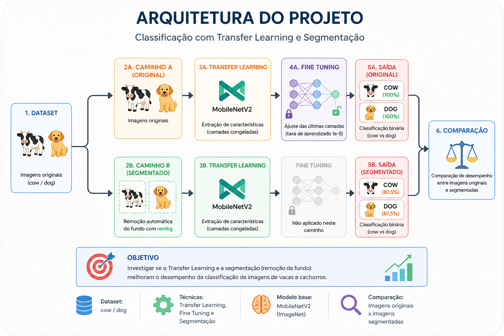

<p align="center">
  
</p>

# 🚀 Projeto Ir Além: Usando Transfer Learning e Fine Tuning
  
### 📌 Fase 6 – Capítulo 1 | Opção 3.2 | FIAP

## 👥 Integrantes
| Nome | RM |
|------|----|
| Leticia Angelim Guerra | 567501 |
| Rivando Bezerra Cavalcanti Neto | 568235 |
| Tales Ferraz de Arruda Domienikan | 567483 |
| Matheus Guimarães França | 567144 |
| João Rafael Gonçalves Ramos | 567908 |

## 🔗 Links
- 📓 **Notebook:** [Abrir no GitHub](https://github.com/matguifra/FIAP-GRAD-ON-IA/blob/main/ANO1/FASE6/cap1-despertar-da-rede-neural/ir_alem/LeticiaAngelimGuerra_rm567501_pbl_fase6_ir_alem.ipynb)
- [](https://colab.research.google.com/drive/1jtmM6vI9VpiTcJZ1c8Gi_tN18H02I0kO?usp=sharing)
- 🎥 **Vídeo:** 
---

## 📜 Descrição

Implementação da opção **3.2 – Transfer Learning e Fine Tuning** do projeto "Ir Além" da Fase 6.
Foram avaliadas duas hipóteses sobre o dataset de classificação binária (`cow` vs `dog`):

1. Redes pré-treinadas superam redes treinadas do zero?
2. A remoção do fundo (segmentação) melhora a classificação?

---

## 🛠️ Tecnologias e Arquitetura

- **Modelo base:** MobileNetV2 (pré-treinada na ImageNet)
- **Framework:** TensorFlow / Keras
- **Segmentação:** rembg (U²-Net)
- **Ambiente:** Google Colab + Google Drive

---

## ⚙️ Fluxo de Processamento (Arquitetura do Projeto)

<p align="center">
  
</p>

O fluxo do projeto consiste em: a partir do dataset original (cow/dog), são criados dois caminhos paralelos — um com as imagens originais e outro com o fundo removido pela `rembg`. Em ambos, a MobileNetV2 pré-treinada na ImageNet é usada como extratora de características (camadas congeladas), seguida de uma camada densa de classificação binária. Após o treinamento inicial, é aplicado Fine Tuning nas últimas 20 camadas com taxa de aprendizado reduzida. Os dois modelos são então comparados quanto à acurácia final.

## 🧠 Justificativa Técnica

### Por que MobileNetV2?
Equilíbrio entre acurácia e eficiência computacional. Treinada na ImageNet (>1M imagens), já possui filtros prontos para detectar texturas, bordas e formas complexas — vantagem decisiva diante do nosso dataset de apenas 80 imagens, no qual treinar uma CNN do zero teria capacidade limitada.

### Estratégia de Fine Tuning
- **Etapa 1:** congelamento total da MobileNetV2, treinando apenas a camada `Dense(1, sigmoid)` por 10 épocas com `Adam` (lr padrão).
- **Etapa 2:** descongelamento das **últimas 20 camadas** com `learning_rate=1e-5` por 5 épocas.

A escolha de descongelar apenas as camadas finais preserva o conhecimento de baixo nível (bordas, texturas) aprendido na ImageNet e adapta somente a representação de alto nível ao domínio específico do problema.

### Pré-processamento
- Redimensionamento para **224×224** (input nativo da MobileNetV2).
- Normalização `rescale=1./255`.
- Sem data augmentation — dataset pequeno e classes muito distintas tornam o ganho marginal.

### Por que rembg para segmentação?
A `rembg` usa o modelo **U²-Net**, treinado para segmentação de primeiro plano genérico. Foi escolhida pela aplicação automática (sem necessidade de rotular máscaras manualmente) e bom desempenho em imagens com objetos centralizados.

## 🧪 Experimento de Segmentação

Foi gerado um dataset paralelo aplicando `rembg.remove()` em cada imagem, salvando o resultado com fundo branco em `dataset_sem_fundo/`. O mesmo pipeline de Transfer Learning foi treinado nesse novo conjunto, permitindo comparação direta com o cenário original.

O notebook inclui a visualização completa do processo de segmentação, demonstrando para imagens de cada classe: **(1)** a imagem original, **(2)** a máscara binária obtida pela rede U²-Net e **(3)** a imagem com o background recortado pela aplicação da máscara.

## 📊 Resultados

| Abordagem | Treino (acc) | Validação (acc) | Teste (acc) | Tempo |
|-----------|:------------:|:---------------:|:-----------:|:-----:|
| Transfer Learning (originais) | 100% | 87,5% | **100%** | ~41s |
| + Fine Tuning | 100% | 100% | **100%** | ~30s |
| Transfer Learning (sem fundo) | 100% | 100% | **87,5%** | ~40s |

### 📌 Análise

- A remoção de fundo **piorou o desempenho** (queda de 100% para 87,5% no teste). Isso indica que o contexto presente no fundo das imagens contribuía para a classificação correta — coerente com o fato da MobileNetV2 ter sido treinada na ImageNet, onde animais aparecem em seus ambientes naturais.
- O `rembg` separa primeiro plano de fundo **sem entendimento semântico**: na imagem da vaca + bezerro, ambos foram preservados na máscara, pois ambos compõem o primeiro plano.
- Para isolar um único objeto específico, técnicas mais avançadas como **segmentação semântica** (Mask R-CNN, SAM) seriam mais adequadas.

## Limitações

- Dataset com apenas **8 imagens de teste** → métricas têm alta variância e podem ocultar erros do modelo.
- Classes muito distintas (`cow` vs `dog`) → tarefa "fácil" para uma rede pré-treinada na ImageNet, que já viu ambas as classes.
- Sem data augmentation → seria essencial em datasets maiores ou para classes mais próximas entre si.
- Avaliação baseada apenas em acurácia → métricas como precision, recall e F1 dariam um diagnóstico mais completo, especialmente em datasets desbalanceados.

## ▶️ Como executar

1. **Estrutura do dataset no Drive:**
   ```
   MyDrive/dataset-classificacao/
   ├── train/
   │   ├── cow/   (32 imagens)
   │   └── dog/   (32 imagens)
   ├── val/
   │   ├── cow/   (4 imagens)
   │   └── dog/   (4 imagens)
   └── test/
       ├── cow/   (4 imagens)
       └── dog/   (4 imagens)
   ```

2. Abrir o notebook no **Google Colab** e montar o Google Drive.

3. Executar as células sequencialmente.

4. **Atenção:** após o `pip install rembg`, reinicie o runtime (`Ambiente de execução → Reiniciar sessão`) e execute novamente a partir da célula de imports. Isso resolve o conflito de versão do `pillow`.

## 📁 Estrutura do Repositório

```
.
├── README.md
├── LeticiaAngelimGuerra_rm567501_pbl_fase6_ir_alem.ipynb
└── assets/
    └── arquitetura.svg
```

