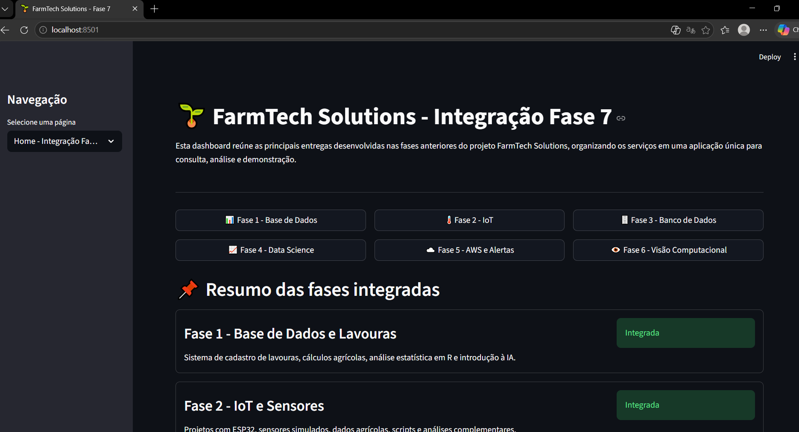
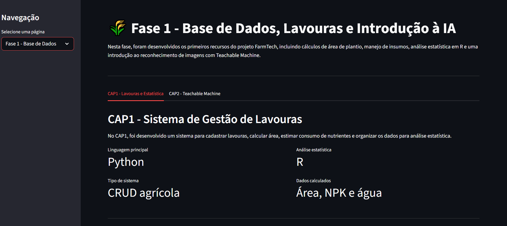
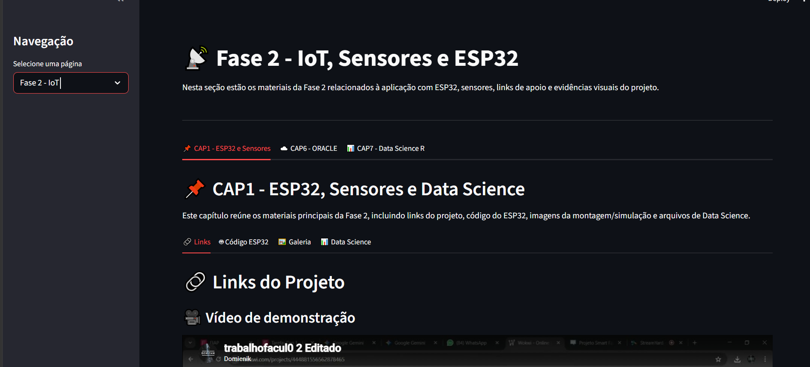
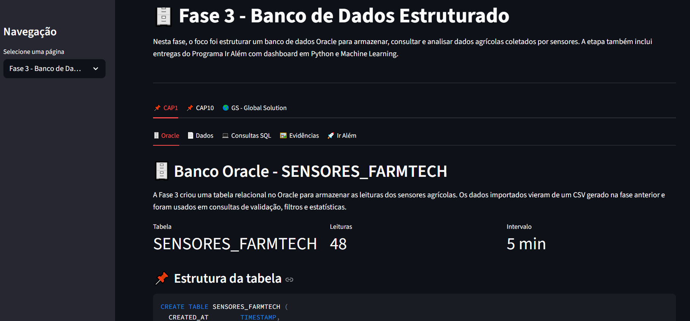
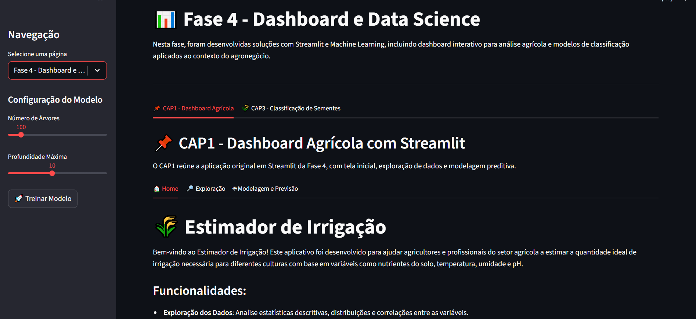
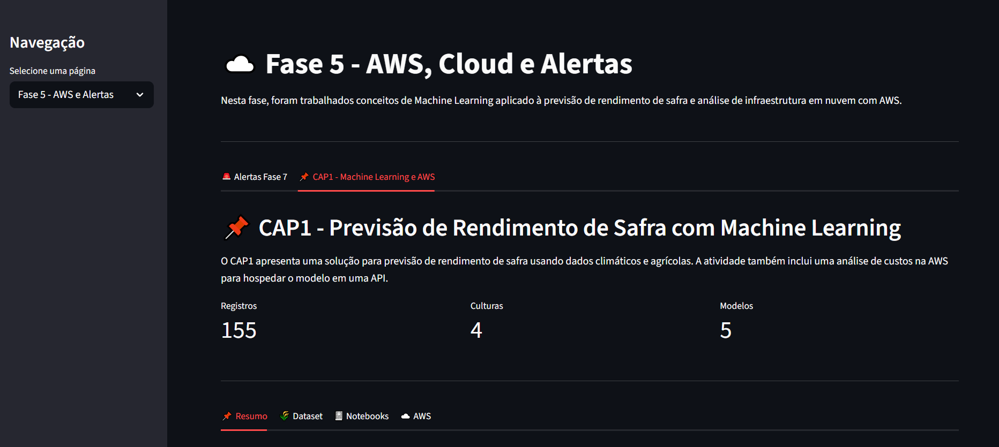
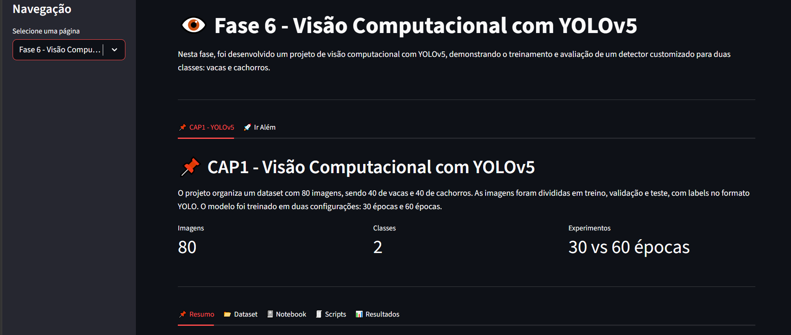

# 🌱 FarmTech Solutions - Fase 7

## 📚 Graduação ON em Inteligência Artificial - FIAP

## 🚀 Fase 7 - IA como Fertilizante Digital  
### Capítulo 1 - A Consolidação de um Sistema

Este repositório apresenta a entrega da **Fase 7** do projeto **FarmTech Solutions**, com o objetivo de consolidar as entregas desenvolvidas nas Fases 1 a 6 em uma única solução integrada.

A aplicação foi desenvolvida em **Python com Streamlit** e centraliza os módulos do projeto em uma dashboard interativa, permitindo acessar dados, códigos, notebooks, evidências, análises, modelos de Machine Learning, visão computacional e o serviço de alertas com AWS.

---

## 👥 Integrantes

| Nome | RM |
|---|---|
| Tales Ferraz de Arruda Domienikan | RM567483 |
| Leticia Angelim Guerra | RM567501 |
| Rivando Bezerra Cavalcanti Neto | RM568235 |
| Matheus Guimarães França | RM567144 |
| João Rafael Gonçalves Ramos | RM567908 |

---

## 🎯 Objetivo da Fase 7

O objetivo desta fase é consolidar o sistema FarmTech em uma única plataforma, integrando as principais entregas das fases anteriores em uma dashboard centralizada.

A solução reúne:

- Base de dados e cálculos agrícolas;
- Projetos com sensores e IoT;
- Banco de dados estruturado;
- Dashboard e modelos de Data Science;
- Análise em nuvem e alertas AWS;
- Visão computacional com YOLOv5;
- Documentação e evidências do funcionamento.

---

## 🧭 Arquitetura da Solução

A Fase 7 centraliza as entregas anteriores em uma única dashboard Streamlit.

O arquivo `app.py` funciona como ponto de entrada da aplicação.  
As páginas de cada fase ficam em `pages/`.  
Os arquivos de apoio, códigos, dados, notebooks, PDFs e imagens ficam em `assets/`.

```text
FIAP-FarmTech-Fase7/
├── README.md
├── app.py
├── requirements.txt
├── pages/
│   ├── home_fase7.py
│   ├── fase1_base_dados.py
│   ├── fase2_iot.py
│   ├── fase3_banco_de_dados_estruturado.py
│   ├── fase4_dashboard_data_science.py
│   ├── fase5_aws_alertas.py
│   └── fase6_visao_computacional.py
├── assets/
│   ├── fase1/
│   ├── fase2/
│   ├── fase3/
│   ├── fase4/
│   ├── fase5/
│   └── fase6/
├── docs/
│   └── prints/
├── aws/
│   └── alerta_irrigacao_fase7/
├── video/
├── .streamlit/
└── .gitignore
```

---

## 🔄 Fluxo Geral da Aplicação

```text
Usuário
  │
  ▼
app.py
  │
  ▼
Dashboard Streamlit
  │
  ├── Home - Integração Fase 7
  ├── Fase 1 - Base de Dados
  ├── Fase 2 - IoT e Sensores
  ├── Fase 3 - Banco de Dados Estruturado
  ├── Fase 4 - Dashboard e Data Science
  ├── Fase 5 - AWS e Alertas
  └── Fase 6 - Visão Computacional
        │
        ▼
assets/
  ├── Dados
  ├── Notebooks
  ├── Códigos
  ├── Imagens
  ├── PDFs
  └── Evidências
```

---

## 🧩 Fases Integradas

### 🌾 Fase 1 - Base de Dados, Lavouras e Introdução à IA

A Fase 1 reúne os primeiros recursos do projeto FarmTech, incluindo:

- Sistema de cadastro de lavouras;
- Cálculo de área de plantio;
- Manejo de insumos;
- Código em Python;
- Análise estatística em R;
- Relatório em PDF;
- Modelo do Teachable Machine.

Na dashboard, a Fase 1 está organizada em:

```text
CAP1 - Lavouras e Estatística
CAP2 - Teachable Machine
```

---

### 📡 Fase 2 - IoT, Sensores e ESP32

A Fase 2 apresenta os materiais relacionados ao uso de sensores, ESP32 e análise de dados.

Inclui:

- Links do projeto;
- Código ESP32;
- Galeria de imagens;
- Arquivos de Data Science;
- Dados de sensores;
- Modelo da bomba;
- Capítulos adicionais com Oracle e análise estatística em R.

Na dashboard, a Fase 2 está organizada em:

```text
CAP1 - ESP32 e Sensores
CAP6 - Oracle
CAP7 - Data Science R
```

---

### 🗄️ Fase 3 - Banco de Dados Estruturado

A Fase 3 integra o banco de dados Oracle utilizado para armazenar e consultar dados agrícolas coletados por sensores.

Inclui:

- Estrutura da tabela `SENSORES_FARMTECH`;
- Dados dos sensores;
- Consultas SQL;
- Prints e evidências;
- Programa Ir Além;
- CAP10 com Machine Learning;
- Global Solution.

Na dashboard, a Fase 3 está organizada em:

```text
CAP1 - Oracle, Dados, SQL, Evidências e Ir Além
CAP10 - Aprendizado de Máquina
GS - Global Solution
```

---

### 📊 Fase 4 - Dashboard e Data Science

A Fase 4 foi usada como base para a dashboard da integração final. Ela apresenta recursos de análise, exploração de dados e modelagem preditiva.

Inclui:

- Tela inicial da aplicação original;
- Exploração de dados agrícolas;
- Modelagem e previsão;
- Classificação de sementes com Machine Learning.

Na dashboard, a Fase 4 está organizada em:

```text
CAP1 - Dashboard Agrícola
CAP3 - Classificação de Sementes
```

---

### ☁️ Fase 5 - AWS, Cloud e Alertas

A Fase 5 reúne os materiais relacionados à nuvem, análise de custos e Machine Learning aplicado ao rendimento agrícola.

Além disso, nesta fase foi integrada a solução de alertas AWS exigida na Fase 7.

Inclui:

- Dataset `crop_yield.csv`;
- Notebooks de Machine Learning;
- Estimativa de custos AWS;
- Evidências da AWS;
- Serviço de alertas com AWS SNS;
- Envio de notificações por e-mail.

Na dashboard, a Fase 5 está organizada em:

```text
Alertas Fase 7
CAP1 - Machine Learning e AWS
```

---

### 👁️ Fase 6 - Visão Computacional

A Fase 6 apresenta uma solução de visão computacional usando YOLOv5.

O projeto treina e avalia um detector customizado para identificar duas classes:

- `cow`
- `dog`

Inclui:

- Dataset no padrão YOLO;
- Notebook end-to-end;
- Scripts de preparação e rotulação;
- Resultados de treino com 30 e 60 épocas;
- Evidências visuais;
- Ir Além com Transfer Learning e Fine Tuning usando MobileNetV2.

Na dashboard, a Fase 6 está organizada em:

```text
CAP1 - YOLOv5
Ir Além - Transfer Learning e Fine Tuning
```

---

## 🚨 Serviço de Alertas AWS

A Fase 7 exige a implementação de um serviço de alertas utilizando a infraestrutura AWS.

Para isso, foi desenvolvido um módulo de mensageria que lê dados agrícolas de sensores e verifica condições críticas. Quando uma condição de risco é detectada, o sistema envia uma notificação por e-mail utilizando **AWS SNS**.

---

### ☁️ Serviço utilizado

| Item | Configuração |
|---|---|
| Serviço AWS | Amazon SNS |
| Região | sa-east-1 - São Paulo |
| Tipo de notificação | E-mail |
| Tópico | AlertasAgroFiap |

---

### ⚠️ Regras de alerta

| Parâmetro | Condição crítica |
|---|---|
| pH | Abaixo de 4.5 ou acima de 7.5 |
| NPK | N < 8, P < 80 ou K < 80 com bomba ligada |
| Umidade | Abaixo de 20% |

---

### 🔁 Fluxo do alerta

```text
dados_sensores.csv
        ↓
Script Python lê a última leitura
        ↓
Sistema verifica as regras críticas
        ↓
Se houver problema, publica mensagem no AWS SNS
        ↓
Funcionário recebe e-mail com a ação recomendada
```

---

### 🧠 Exemplo de alerta

```text
ALERTA DE PH CRÍTICO

O nível de pH atingiu 2.5, fora do limite seguro de 4.5 - 7.5.

AÇÃO:
Enviar equipe ao setor para correção de solo.
```

---

### 📁 Arquivos do serviço AWS

```text
aws/
└── alerta_irrigacao_fase7/
    ├── alerta_irrigacao_aws.py
    ├── dados_sensores.csv
    ├── README.md
    └── prints/
```

---

## 🛠️ Tecnologias Utilizadas

- Python
- Streamlit
- Pandas
- NumPy
- Scikit-learn
- Matplotlib
- Plotly
- Seaborn
- R
- Oracle Database
- ESP32
- YOLOv5
- TensorFlow / Keras
- AWS SNS
- GitHub

---

## ▶️ Como Executar o Projeto

### 1. Clonar o repositório

```bash
git clone https://github.com/domienik/FIAP-FarmTech-Fase7.git
```

### 2. Entrar na pasta do projeto

```bash
cd FIAP-FarmTech-Fase7
```

### 3. Instalar as dependências

```bash
pip install -r requirements.txt
```

### 4. Rodar a dashboard

```bash
streamlit run app.py
```

A aplicação será aberta no navegador, normalmente em:

```text
http://localhost:8501
```

---

## 📦 Dependências principais

As dependências do dashboard estão listadas no arquivo:

```text
requirements.txt
```

Principais bibliotecas:

```text
streamlit
pandas
numpy
openpyxl
matplotlib
plotly
seaborn
scikit-learn
boto3
```

---

## 🖼️ Prints da Dashboard

### Home - Integração Fase 7



### Fase 1 - Base de Dados



### Fase 2 - IoT



### Fase 3 - Banco de Dados



### Fase 4 - Dashboard e Data Science



### Fase 5 - AWS e Alertas



### Fase 6 - Visão Computacional



---

## 🎥 Vídeo Demonstrativo

O vídeo demonstrativo apresenta:

- A dashboard integrada;
- O funcionamento dos módulos;
- O serviço de alertas AWS;
- A arquitetura geral da solução.

📌 Link do vídeo no YouTube, modo não listado:

```text
https://youtu.be/Qp0HjKJjMR8
```

---

## 📚 Licença

Este projeto acadêmico segue o modelo de documentação FIAP.

MODELO GIT FIAP por FIAP está licenciado sob Attribution 4.0 International.
