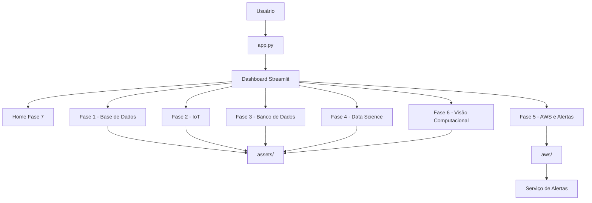

# Documentação complementar

Esta pasta reúne materiais de apoio da Fase 7, como prints da dashboard, diagramas de arquitetura, evidências de funcionamento e documentos auxiliares usados na apresentação final.

## Conteúdos previstos

- Prints da dashboard integrada
- Diagrama da arquitetura geral
- Evidências da configuração AWS
- Materiais usados no vídeo demonstrativo

## 🧭 Arquitetura da Solução

A Fase 7 centraliza as entregas anteriores em uma única dashboard Streamlit.  
O arquivo `app.py` funciona como ponto de entrada da aplicação, enquanto as páginas de cada fase ficam em `pages/` e os arquivos de apoio ficam em `assets/`.

```text
FIAP-FarmTech-Fase7/
│
├── app.py                  # Arquivo principal da dashboard
├── pages/                  # Telas de cada fase integrada
│   ├── home_fase7.py
│   ├── fase1_base_dados.py
│   ├── fase2_iot.py
│   ├── fase3_banco_de_dados_estruturado.py
│   ├── fase4_dashboard_data_science.py
│   ├── fase5_aws_alertas.py
│   └── fase6_visao_computacional.py
│
├── assets/                 # Dados, códigos, notebooks, imagens e evidências
│   ├── fase1/
│   ├── fase2/
│   ├── fase3/
│   ├── fase4/
│   ├── fase5/
│   └── fase6/
│
├── docs/                   # Documentação complementar e prints
├── aws/                    # Materiais do serviço de alertas AWS
├── video/                  # Link/roteiro do vídeo demonstrativo
└── requirements.txt        # Dependências do projet

```

```

Fluxo geral da aplicação
Usuário
  │
  ▼
app.py
  │
  ▼
Dashboard Streamlit
  │
  ├── Home - Integração Fase 7
  ├── Fase 1 - Base de Dados
  ├── Fase 2 - IoT e Sensores
  ├── Fase 3 - Banco de Dados Estruturado
  ├── Fase 4 - Dashboard e Data Science
  ├── Fase 5 - AWS e Alertas
  └── Fase 6 - Visão Computacional
        │
        ▼
assets/
  ├── Dados
  ├── Notebooks
  ├── Códigos
  ├── Imagens
  ├── PDFs
  └── Evidências
Integração entre as fases
Fase 1 ──► Dados agrícolas e lavouras
Fase 2 ──► Sensores, ESP32 e dados IoT
Fase 3 ──► Banco Oracle e consultas SQL
Fase 4 ──► Dashboard, exploração e modelagem
Fase 5 ──► AWS, cloud e alertas
Fase 6 ──► Visão computacional com YOLOv5
   │
   ▼
Fase 7 ──► Dashboard central integrada
```




## 🖼️ Prints da Dashboard

### Home - Integração Fase 7


### Fase 1 - Base de Dados


### Fase 2 - IoT


### Fase 3 - Banco de Dados


### Fase 4 - Dashboard e Data Science


### Fase 5 - AWS e Alertas


### Fase 6 - Visão Computacional

